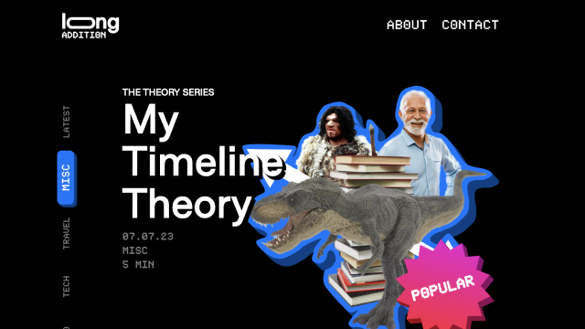

# Long Addition

## Table of Contents

- [General Info](#general-information)
- [Technologies Used](#technologies-used)
- [Features](#features)
- [Project Status](#project-status)
- [Issues](#issues)
- [To Do](#to-do)

## General Information

Long Addition is both an experiement in blog design and my own
creative writing. Loved the layout and decided to forego a CMS and
Markdown. This proved to be very cumbersome and a massive barrier
to getting writing up. I plan on revamping it with a simpler
Markdown in early 2024.

Tech wise, I learned a ton about routing, asset management with
Cloudinary, and adding my own twist (the 3D popping effect) with
2D resources.

## Technologies Used

- Next.js v13.4.1
- React Rewards v2.0.4
- Formik v2.2.9
- Framer Motion v10.12.9

## Features

- 3D popping effect with 2D Tailwind classes
- Basic confetti animations with React Rewards
- Customizable article layout

## Project Status

- Version 1: _complete as of 5/15/23_
- Version 2: _in progress_

## Issues

- When pressing Copy Link at the bottom of an article, React Rewards triggers a confetti explosion that shifts the screen down if you try to scroll at the same time

## To Do

| Task                                 | Status |
| ------------------------------------ | ------ |
| Revamp design for simpler experience | :x:    |
| Implement MDX                        | :x:    |
